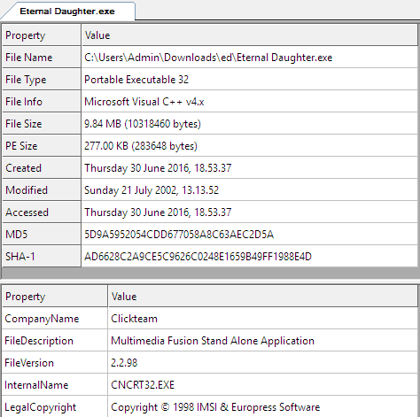
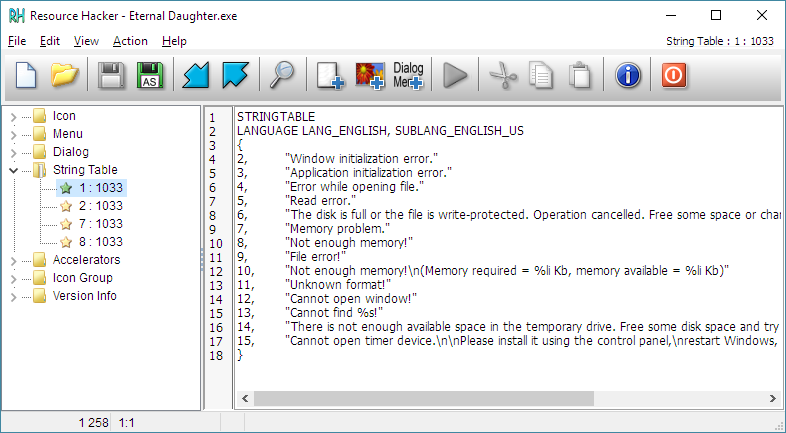
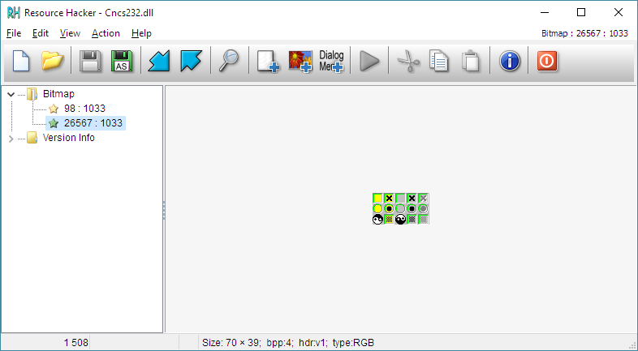
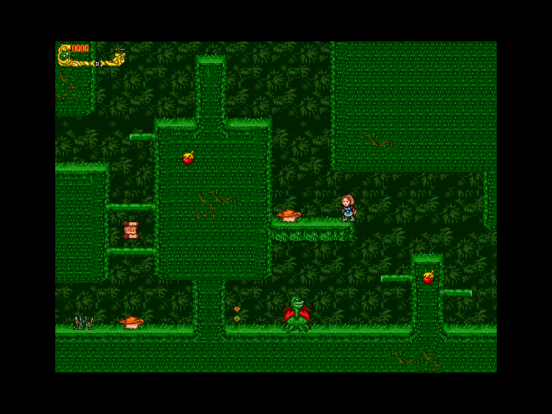
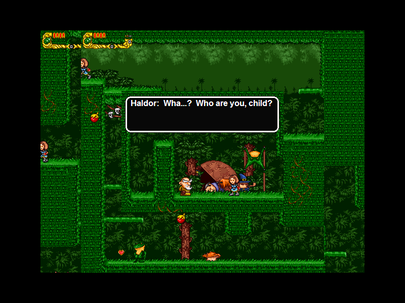
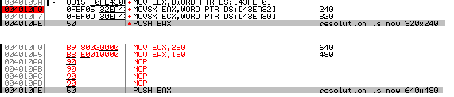
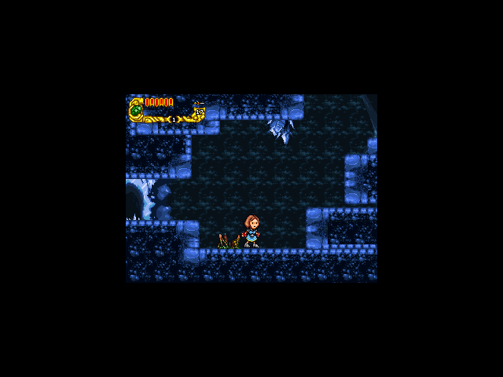
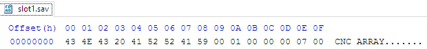

REternal Daughter v 0.1.0
=========================

About
-----
REternal Daughter is a reverse engineering project for a freeware
video game Eternal Daughter. It attempts to fix issues with running
the game on modern machines.

Eternal Daughter is a metroidvania (open world 2D platformer) by
Blackeye Software (Derek Yu and Jon Perry). It was released as
freeware in 2002. More information about the game can be found in
[this article written by the author of REternal Daughter]
(http://www.hardcoregaming101.net/eternaldaughter/eternaldaughter.htm).

Currently, REternal Daughter is able to run the game in a supported
640x480 resolution without upscaling (game as a 'window' within a black
screen). Experimental upscaling feature can be enabled by a -u command
line switch, although it has issues with levels smaller than 640x480
(see below).

Issues with Eternal Daughter
----------------------------
Eternal Daughter runs natively in a 320x240 resolution which is too low
for modern GPUs. It also has problems with its MIDI playback functions
as if a music track changes while a sound effect is playing, the sound
effect will loop endlessly and the game will become unplayably slow.

Usage: reternal.py
------------------
To use REternal Daughter, copy its files to your Eternal Daughter
directory and run reternal.py. If you don't have the game, it can be
freely downloaded from [here](http://www.derekyu.com/games.html).

    usage: reternal.py [-h] [-i INPUT] [-u] [-p PATCHFILE] [-n] [-r]
    
    Unofficial Eternal Daughter resolution fix
    
    optional arguments:
      -h, --help            show this help message and exit
      -i INPUT, --input INPUT
                            Input file (default: "Eternal Daughter.exe")
      -u, --upscale         Upscale the game instead of just forcing higher
                            resolution (experimental)
      -p PATCHFILE, --patchfile PATCHFILE
                            Custom patchfile in BSDiff format (overrides -u)
      -n, --nofix           Don't fix the game, just run it (overrides -u and -p)
      -r, --replace         Permanently replace input file with a patched version
                            (overrides -n)
      
Usage: saveutil.py
------------------
    usage: saveutil.py [-h] [-p] [-l LIFE] [-g GEMS] [-G GEMS_MAX] [-L LOCATION]
                       [-a ATTACK_POWER] [-d {0,1}] [-e {0,1,2,3,4,5}] [-H {0,1}]
                       [-M {0,1}] [-O {0,1}] [-S {0,1}]
                       [-W {knife,hammer,mojak,ozar,sigil}]
                       {1,2,3}
    
    Eternal Daughter save reader/editor. Part of the REternal Daughter project. To
    use, place in the game's folder or any other folder containing ED savefiles
    with slot{1-3}.sav.
    
    positional arguments:
      {1,2,3}               Save slot number
    
    optional arguments:
      -h, --help            show this help message and exit
      -p, --print           Print information about current savefile
      -l LIFE, --life LIFE  Set life to provided value
      -g GEMS, --gems GEMS  Set current number of gems (ammo)
      -G GEMS_MAX, --gems-max GEMS_MAX
                            Set maximum number of gems
      -L LOCATION, --location LOCATION
                            Teleport to chosen savespot
      -a ATTACK_POWER, --attack-power ATTACK_POWER
                            Set attack power
      -d {0,1}, --doublejump {0,1}
                            Enable/disable double jump
      -e {0,1,2,3,4,5}, --elanduru {0,1,2,3,4,5}
                            Pick Elanduru's form (0 - no Elanduru, 5 - adult
                            Elanduru with mask)
      -H {0,1}, --hammer {0,1}
                            Enable/disable hammer
      -M {0,1}, --mojak {0,1}
                            Enable/disable Mojak
      -O {0,1}, --ozar {0,1}
                            Enable/disable Ozar's Flame
      -S {0,1}, --sigil {0,1}
                            Enable/disable Sigil
      -W {knife,hammer,mojak,ozar,sigil}, --weapon {knife,hammer,mojak,ozar,sigil}
                            Current weapon

Reversing Eternal Daughter
--------------------------
Eternal Daughter was created with an old version of Multimedia Fusion,
a game engine relatively popular among indie developers for its
user-friendly 'no programming' approach.

Game logic seems to reside completely inside Eternal Daughter.exe.
The game also loads a dynamic library Cncs232.dll which contains
multimedia-related functionality (presumably, this includes buggy
MIDI/sound effects code).

Unfortunately, Eternal Daughter.exe also contains all the game data as
there are no files containing sprites or sounds anywhere in the game
folder. Even worse: all that data seems to be in custom formats as
Resource Hacker is unable to extract any images or music. Even strings
table doesn't contain the in-game text, just standard diagnostic
messages. Opening Cncs232.dll with it is similarly fruitless: it has
a few bitmaps but nothing similar to game content.

As quick google search doesn't show any way of extracting data from
compiled Multimedia Fusion games, the only thing left is disassembling
the game and fixing what we can. The resolution is an obvious choice:
I step through game startup in OllyDbg, find the place from which
resolution data is pulled and write a simple fix. I hijack the game's
execution early by calling to a code cave near the end of the
application's text section. In that cave, I overwrite relevant data
section fragments with 640x480 (values here presented in hex), call the
function that should have been called instead of my hook and return to
normal flow.

This appears to be working well: the whole game is drawn in higher
resolution and it looks good. Unfortunately, there are problems here and
there. The minor one is that triggers in cutscenes are visible. The
bigger one is that if you come from a bigger level to a smaller one,
those larger portions are not redrawn and it looks stupid. You can
enable this option with -u command line switch in reternal.py but it's
not the default.

I change my strategy: the game will run in a higher resolution but
it's not going to be upscaled. I modify the executable again, this time
hardcoding  640x480 in two functions that draw the window and leaving
the values from the data section intact for drawing game content.

Of course, the game now isn't really in high resolution. It's still
in 320x240, it's just that the game window is bigger so the GPus don't
go crazy. It also doesn't look as well as it should but it's far less
annoying than the previous version.

I then turn my fixes into a Python/Hy (Python because rapid prototyping,
Hy because I like Lisp-like syntax) program. There's a lot more that can
be done but I think it's a decent start.

Reversing save files
--------------------
Eternal Daughter uses slotX.sav for holding saved games, where X is
a number between 1 and 3. They store binary data and opening them with
a hex editor gives us a hint about what to do next: the first 8 bytes
contain a magic number which is a representation of ASCII string
'CNC ARRAY'.

'CNC Array' is the format used by Multimedia Fusion to store
the engine's array objects. According to a post by Dines, user of
Clickteam forums, the format works as follows:

    offset  type    details
    -----------------------
      - HEADER CHUNK -
    0000    ascii   "CNC ARRAY"
    0009    byte    Null
    000A    dword   Always '2' for some reason. Maybe version number?
    000E    dword   X dimension size
    0012    dword   Y dimension size
    0016    dword   Z dimension size
    001A    dword   Settings (see note 1)
    001E    (Data chunks follow from here)
    
      - DATA CHUNK (number array) -
    0000    dword   value of this item in the array.
    
    This repeats for every element in the array, until it reaches
    the end of the file. There is one dword per element.
    
      - DATA CHUNK (text array) -
    0000    dword   Length of text
    0004    ascii   Stored text
    
      - Note 1 (Flags/Settings) -
    This shows the meaning of the various bits in the flag byte:
    
    -------- -------- -------- ----gbtn
    g = Global Array (1 = yes)
    b = 1-Based Array (1 = yes)
    t = Text Array (1 = yes)
    n = Number Array (1 = yes)
    - = Bit is not used.

Do note that in hex editor, byte 000A stores the value '1' while the
post claims it's always '2'. This seems to confirm the poster's theory
that this is a version information variable. Looking further into the
file, its settings variable (001A) stores the value of 5. In binary,
a DWORD representing 5 is 29 0s followed by 101. Therefore, each save
is a 1-indexed array of 32-bit integers.

Through trial and error, I discovered the meanings behind some of the
variables in savefile:

|Offset |Variable           |Comments                                              |
|:-----:|:-----------------:|------------------------------------------------------|
|0x1e  |Health              |-                                                     |
|0x22  |Double jump         |True/false                                            |
|0x3a  |Current gems (ammo) |Can be larger than max                                |
|0x42  |Hammer              |True/false                                            |
|0x56  |Max gems            |Can be lower than current                             |
|0x5e  |Mojak               |True/false                                            |
|0x72  |Current weapon      |1 - knife, 2 - hammer, 3 - Mojak, 4 - Ozar, 5 - Sigil |
|0x76  |Ozar's Flame        |True/false                                            |
|0x7a  |Elanduru save icon  |True/false                                            |
|0x8e  |Elanduru's form     |0 - none, 1 -3 - young, 4 - adult, 5 - adult with mask|
|0x96  |Sigil               |True/false                                            |
|0xaa  |Attack power        |-                                                     |
|0xc6  |Current location    |-                                                     |

I use that knowledge to write a save editor/analyzer.

TODO
----
+ better upscaling (draw empty window after switching stages?)
+ don't waste so much screen real estate in non-upscaling mode
  (find a way to draw some nice-looking border in the window)
+ find a way to enable windowed mode (the game claims it supports one
  but it doesn't work)
+ fix the MIDI issue (might be hard to do as Cncs232.dll functions
  are accessed by offset instead of symbol so it's not trivial
  to write a drop-in replacement)
+ RE save files

Author
------
REternal Daughter was written by Maciej Miszczyk

License
-------

    This program is free software; you can redistribute it and/or modify
    it under the terms of the GNU General Public License as published by
    the Free Software Foundation; either version 2 of the License, or
    (at your option) any later version.

    This program is distributed in the hope that it will be useful,
    but WITHOUT ANY WARRANTY; without even the implied warranty of
    MERCHANTABILITY or FITNESS FOR A PARTICULAR PURPOSE.  See the
    GNU General Public License for more details.

    You should have received a copy of the GNU General Public License
    along with this program; if not, write to the Free Software
    Foundation, Inc., 51 Franklin St, Fifth Floor, Boston, MA  02110-1301  USA